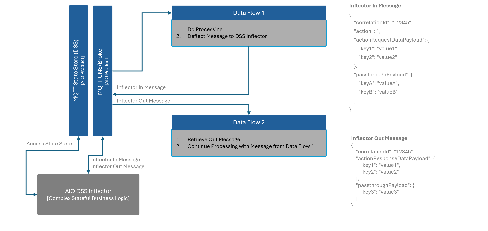

# AIO DSS Inflector

The primary purpose of this service is to allow AIO's Distributed State Store (DSS) be part of Data Flow for both read and write purposes, by virtue of that it's addressing the current gap in AIO to perform the complex and stateful message processing which Data Flows are unable to do today.

The solution works on the messaging concept of pub-sub and lean towards building smaller services (nano) on top of Dataflow, as depicted below:



## Dev Loop

Follow these steps to deploy this solution:

1. Clone the repo locally and move to the solution directory

    `git clone git@github.com:git@github.com:suneetnangia/aio-dss-inflector.git && cd aio-dss-inflector`

2. Run Inflector in existing AIO environment

    1. Create a local connection to your AIO deployment in Azure (assuming you have run `az login` already and have an Azure AIO deployment)

        `az connectedk8s proxy -n <Arc Connected Cluster> -g <Arc Connected Cluster Resource Group>`

    2. Confgiure AIO's MQTT Broker for local access (assuming we have a non-auth/non-TLS Broker Listener at 1883 [configured in AIO](https://learn.microsoft.com/en-us/azure/iot-operations/manage-mqtt-broker/howto-configure-brokerlistener?tabs=portal%2Ctest#example-create-a-new-listener-with-two-ports))

        `kubectl port-forward svc/aio-broker 1883:1883 -n azure-iot-operations`

    3. Run the project (run each cmd in different terminal window)

        1. `make run-service`
        2. `make pub`
        3. `make sub`

    4. Observe the terminal windows above for message processing details.

### Sample `appsettings.json` File for Production

```json
{
  "Mqtt": {
    "Logging": true,
    "Host": "aio-broker",
    "Port": 18883,
    "UseTls": true,
    "Username": "",
    "Password": "",
    "SatFilePath": "/var/run/secrets/tokens/broker-sat",
    "CaFilePath": "/var/run/certs/ca.crt",
    "ClientId": "Aio.Dss.Inflector.Svc"
  },
  "Logging": {
    "LogLevel": {
      "Default": "Information",
      "Microsoft.Hosting.Lifetime": "Information"
    }
  }
}
```
